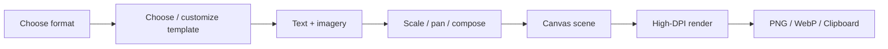
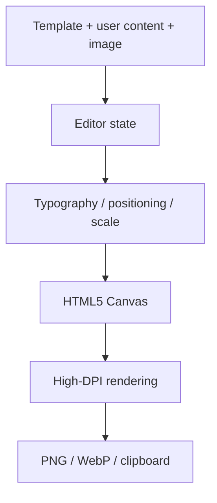

# 🎯 NailedIt

> **A browser-based thumbnail and social-graphic studio for getting the visual right, fast.**

`NailedIt` is a lightweight creative tool for producing polished graphics directly in the browser — especially **YouTube thumbnails, blog/Open Graph images, and vertical social content**.

It is one of the standalone public tools in the **.dot** ecosystem.

## 🔄 Rendering Workflow



**How to read it:** the editor builds a composition first; only the final canvas stage produces the export. Local image assets can stay in the browser throughout the workflow.

## 🧩 Canvas Data Flow



## ✨ What It Does

- 🎨 Professional templates designed for strong visual hierarchy.
- 📺 YouTube formats.
- 🌐 Blog / Open Graph formats.
- 📱 Vertical formats for Reels and social content.
- ✍️ Custom typography/content — title, subtitle, category, keywords, logo, and imagery.
- 🖼️ Image positioning with scale and pan controls.
- 🖥️ High-DPI Canvas rendering.
- 📤 PNG and WebP export plus clipboard image copying.
- 🔒 Client-side image processing.

## 🛠️ Tech Stack

React · TypeScript · Vite · Tailwind CSS · HTML5 Canvas · Lucide React

## 🚀 Run Locally

```bash
git clone https://github.com/cser-utkarsh-raj/NailedIt.git
cd NailedIt
npm install
npm run dev
npm run build
```

## 🎯 Design & Engineering Principles

- Preserve component contracts and reusable template logic.
- Keep preview rendering responsive.
- Use deliberate composition, typography, and spacing.
- Handle asynchronous image loading safely.
- Prefer meaningful design systems over arbitrary rectangles and magic numbers.
- Keep the browser-first workflow fast and private.

## 🌐 Part of .dot

NailedIt is a standalone `.dot` tool: small enough to use immediately, but polished enough to solve a real creative task.

> **NailedIt · Make the first impression count.**
>
> **Presented by .dot**
